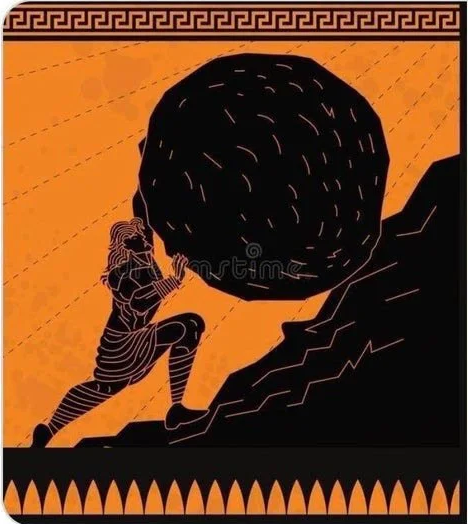
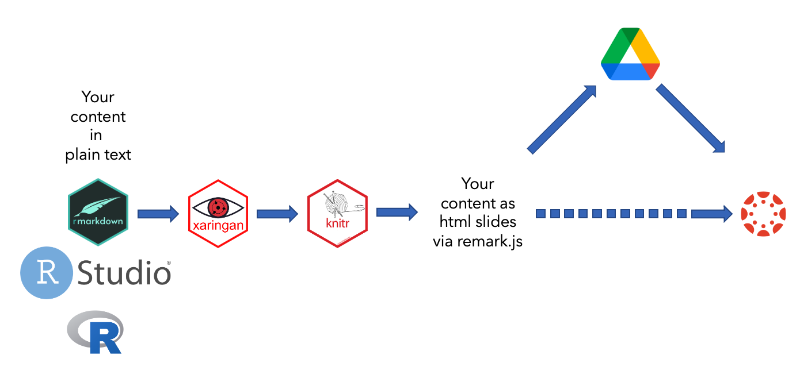
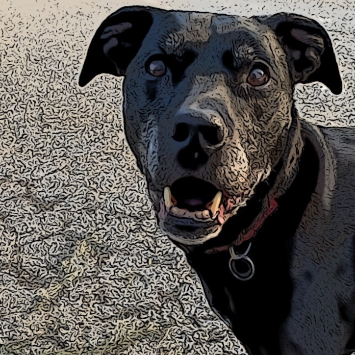

```{r setup, include=FALSE, echo = FALSE, message=FALSE, warning=FALSE}
options(htmltools.dir.version = FALSE)
knitr::opts_chunk$set(fig.retina = 3,
                      fig.width = 7,
                      fig.height = 5, 
                      echo = FALSE, 
                      message = FALSE, 
                      warning = FALSE, 
                      include = TRUE)

library(tidyverse)
library(knitr)
library(xaringan)
library(googledrive)
library(pagedown)

```
#### Keep your Class Presentations Updated with RMarkdown 
### IT Professional Conference 2022

## Do you see yourself in this scenario?

1. Prepare your class materials
1. Make slides 
1. Spend time make it look good
1. Feeling guilty if you don't 
1. Upload them to Canvas 
1. Find issues/typos/bugs 
1. Fix the issues 
1. Re-upload them to Canvas 

---
class: center, middle
#### Keep your Class Presentations Updated with RMarkdown 
### IT Professional Conference 2022

```{r, fig.height=5}

```


---
name: workflow
#### Keep your Class Presentations Updated with RMarkdown 
### IT Professional Conference 2022

## What is the solution?


```{r}


```
[Go back to Canvas](#canvas)

???
if this is appealing to you, you are in the right place
I'll assume you know ... 
---

#### Keep your Class Presentations Updated with RMarkdown 
### IT Professional Conference 2022

## Installing xaringan

You can download Xaringan from CRAN 

`install.packages('xaringan')`

or from GitHub

`devtools::install_github('xaringan')`

---
#### Keep your Class Presentations Updated with RMarkdown 
### IT Professional Conference 2022

## Simple formatting using Markdown syntax 

Markdown formatting is available for you to use throughout 

_italics_, **bold**, ~~strikethrough~~

$$sin(x)^2 + cos(x)^2 = 1$$

[link](www.wisc.edu)

# header 1
## header 2
### header 3

---
#### Keep your Class Presentations Updated with RMarkdown 
### IT Professional Conference 2022

## Adding slides 

- Slides begin immediately after your YAML header.
- Slides end with three dashes.
- Incremental slides end with two dashes.
- You can leave notes to yourself after three question marks right before the slide ends.

???
Like so. This is visible only to you in presenter mode.

---
#### Keep your Class Presentations Updated with RMarkdown 
### IT Professional Conference 2022

## Adding slides incrementally

- Slides begin immediately after your YAML header.

--
- Slides end with three dashes.  

--
- Incremental slides end with two dashes.  

--
- You can leave notes to yourself after three question marks right before the slide ends.  

???
Like so. This continues to be visible only to you in presenter mode.
---
#### Keep your Class Presentations Updated with RMarkdown 
### IT Professional Conference 2022

## Useful formatting options

- Your content can be aligned horizontally: left/center/right
- And vertically: top/middle/bottom  

The next slide will start with the keyword `class: center, middle`
---
class: center, middle

I have two dogs. They are Chompers and Wiggles
---
#### Keep your Class Presentations Updated with RMarkdown 
### IT Professional Conference 2022

## You can apply formatting to specific text in your slides

.left[this text is to the left of the page]
.center[this text is in the center of the page]
.right[this text is to the right of the page]

---
#### Keep your Class Presentations Updated with RMarkdown 
### IT Professional Conference 2022

## You slides can have a two-column layout

If you use `.pull-left[]` and `.pull-right[]`, the columns are sized the same.   
About 47% of the total width of the slide. 

.pull-left[
This is Chompers

]

.pull-right[
This is Wiggles

]

---
#### Keep your Class Presentations Updated with RMarkdown 
### IT Professional Conference 2022

## You slides can have a two-column layout

If you use `.left-column[]` and `.right-columns[]`, the columns are not sized the same. 
Left column is 20% and right column is 75%

.left-column[
This is Chompers

]

.right-column[
This is Wiggles

]
---
#### Keep your Class Presentations Updated with RMarkdown 
### IT Professional Conference 2022

## Your slides have all the muscle of RMarkdown behind them

- You can write code that can run 
- You can have data that you can manipulate
- And plot!
- And you can do anything you can do with R

---
#### Keep your Class Presentations Updated with RMarkdown 
### IT Professional Conference 2022

## Showing (off) your code 

```{r echo=TRUE, include = TRUE}
library(babynames)
t_names <- babynames %>%
  filter(name == "Tyler" | 
         name == "Trisha") %>%
  filter(sex == "F") 
glimpse(t_names) #<<

```

---
#### Keep your Class Presentations Updated with RMarkdown 
### IT Professional Conference 2022

## Showing (off) your code 

```{r echo=TRUE, include = TRUE, highlight.output=4:5}

glimpse(t_names) 

```

---
#### Keep your Class Presentations Updated with RMarkdown 
### IT Professional Conference 2022

## Showing (off) your code 

```{r echo=TRUE, include = TRUE, highlight.output=4:5}
ggplot(t_names, aes(x = name, fill = name)) +
  geom_bar()

```

---
#### Keep your Class Presentations Updated with RMarkdown 
### IT Professional Conference 2022

## Showing (off) your code 

```{r echo=TRUE, include = TRUE, highlight.output=4:5}
 
t_names |> head() |> kable(format = "html")

```

---
#### Keep your Class Presentations Updated with RMarkdown 
### IT Professional Conference 2022

## Additional info

[Yi Hui's slides](https://slides.yihui.org/xaringan/#1)

[Alison Hill's slides](https://arm.rbind.io/slides/xaringan.html#1)

[Bookdown Chapter 7](https://bookdown.org/yihui/rmarkdown/xaringan.html)

Themes --> ```names(xaringan::list_css())```

---
name:canvas
#### Keep your Class Presentations Updated with RMarkdown 
### IT Professional Conference 2022

## Now what?
[Workflow diagram](#workflow)


```{r upload-slides-to-goggle-drive, echo=FALSE, message=FALSE, warning=FALSE, include=FALSE, eval=FALSE}


pagedown::chrome_print("itproconf.html", output = "itproconf.pdf")
slides <- drive_put("itproconf.pdf", path = "itproconf/slides.pdf")
slides <- slides %>%
   drive_share(role = "reader", type = "anyone")

```